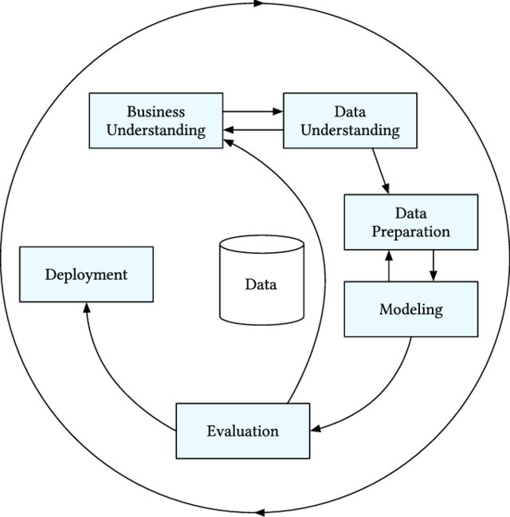
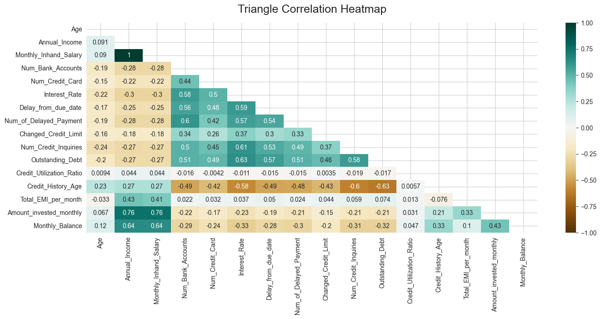
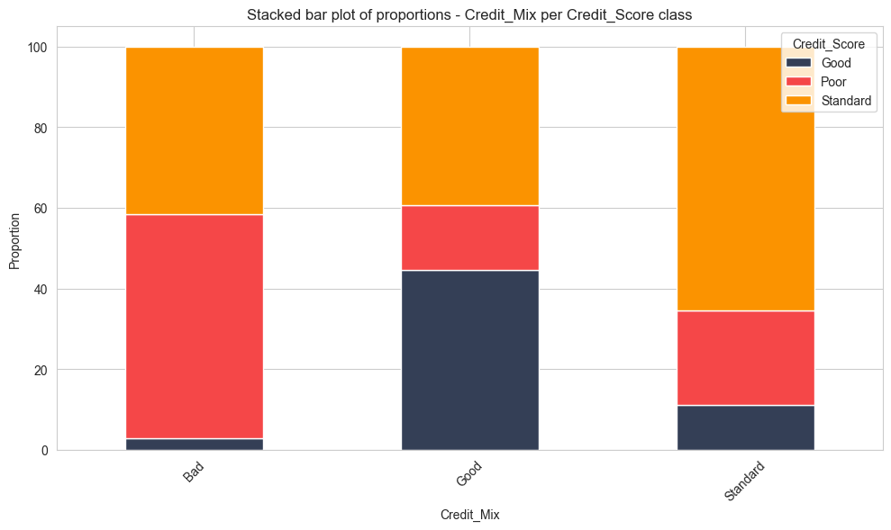
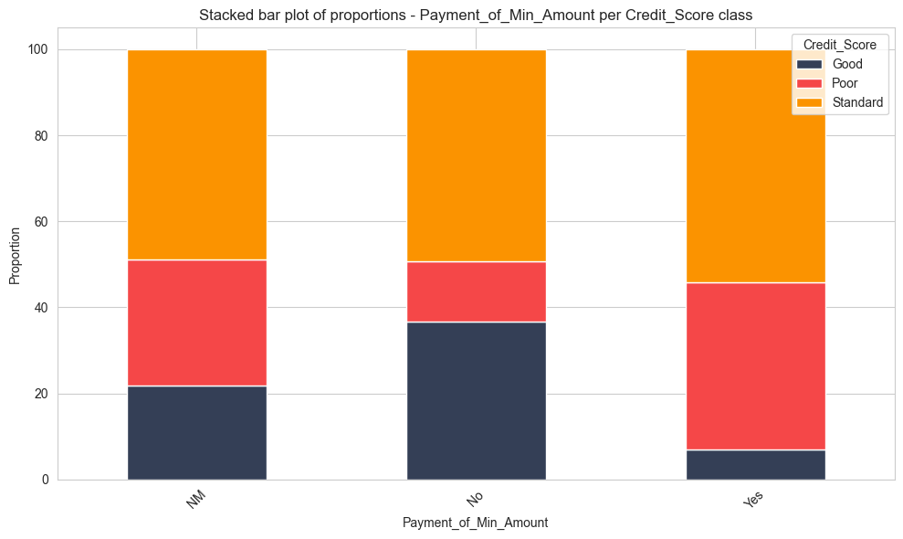
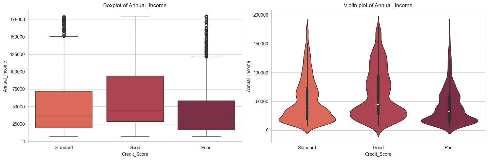
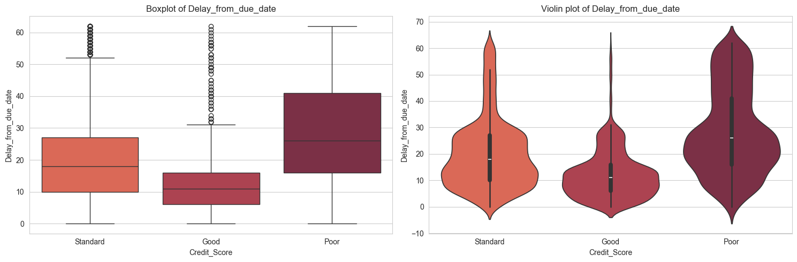
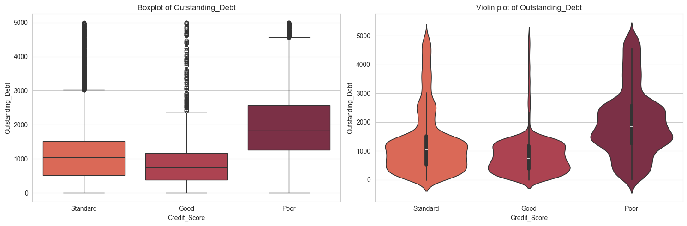
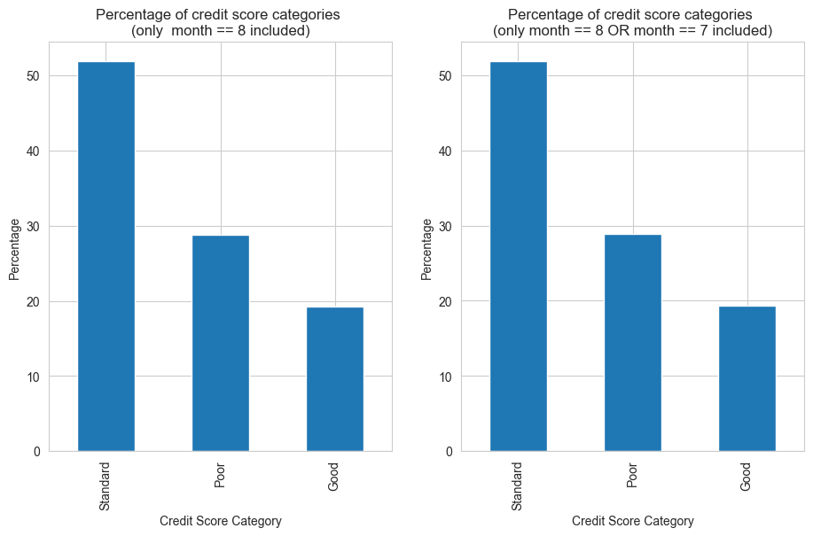
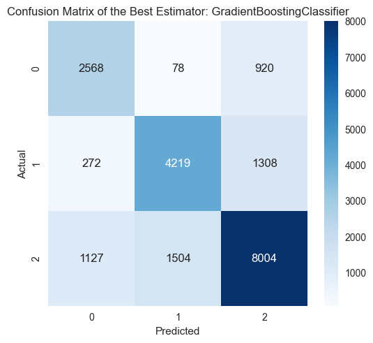
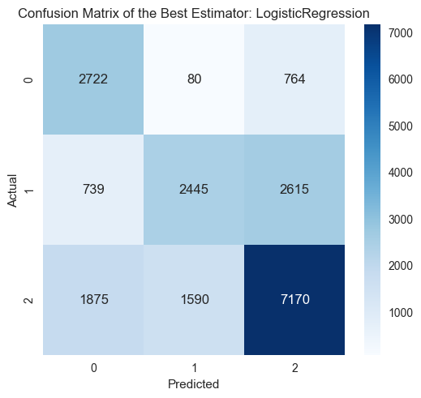

# Enhancing Credit Score Prediction To Promote Financial Inclusion

**Author**: Vassilis Tsoubris

## Executive summary

### Rationale

Financial inclusion remains one of the critical challenges of our time that is central to establishing sustainable and equitable economic growth.
This concept aligns around the provision of comprehensive, sustainable financial services to all individuals, irrespective of their monetary status or societal position.
Financial inclusion particularly aims to uplift those who have been traditionally marginalized or excluded from the financial ecosystem, enabling them to participate in the economy meaningfully and improve their living standards.

One substantial hurdle in the path of financial inclusion is the reliance on conventional credit scoring mechanisms.
Traditional credit scores are a myriad of numbers that reflect a person's credit risk based on their credit history.
Nevertheless, these scoring models often disadvantage underbanked and unbanked individuals, those with limited credit history, or those who demonstrate unconventional financial behavior.
These individuals, often from lower-income groups, rural households, or financially developing regions, inadvertently end up being deemed 'credit invisible' or 'credit unworthy' as their financial behaviors do not conform to conventional credit assessment models.

Consequently, this exclusion from credit systems can hinder their financial growth opportunities, preventing them from availing services like loans, insurances, or investment products.
It creates a loop of financial disempowerment where these individuals cannot establish creditworthiness without access to credit.

Machine Learning approaches possess the potential to bridge this financial divide.
These advanced methodologies can analyze vast and diverse data types - well beyond traditional credit history - to forecast an individual's credit behavior more accurately.
By utilizing Machine Learning algorithms, we could design more inclusive credit scoring models that could consider a broader range of factors.

### Research / Business Question

**Can machine learning and AI models accurately predict individual credit scores based on financial, behavioural and demographic data, thereby improving the decision-making process for lending institutions and promote Financial Inclusion for individuals?**

The machine learning and AI models' capacity to analyze multifarious data could potentially unlock nuanced insights into an individual's creditworthiness. But can these advanced techniques ensure accuracy in predicting credit scores?

### Data Sources

The primary dataset for this analysis will be sourced from Kaggle, specifically the "Credit Score Classification" dataset available at this [link](https://www.kaggle.com/datasets/parisrohan/credit-score-classification?select=train.csv).
This dataset contains historical financial data, including payment history, credit usage, and personal demographics, crucial for predicting credit scores.
The target variable is the credit score of the customer ( 3 classes: Poor, Standard, Good ).

The initial dataset comprises 100,000 rows and 28 columns, each representing a certain feature of the dataset.
Below a **brief explanation of each feature is demonstrated**:

- **Index**: A default column provided by pandas, serving as a unique identifier for each row.
- **ID**: Object type column which presumably contains unique identifiers for something, possibly transactions.
- **Customer_ID**: Object type column generally holding unique identifiers for customers.
- **Month**: A string that symbolically represents the creation date of the record.
- **Name**: The names of individuals which seems to have 9985 missing values.
- **Age**: Likely representing the ages of individuals.
- **SSN**: Contains the Social Security Number, a unique number identifying each individual.
- **Occupation**: Likely holds information regarding the occupations of the customers.
- **Annual_Income**: A string representation of an individual's annual income.
- **Monthly_Inhand_Salary**: A numerical representation of the monthly salary with a mean of around 4194.2, potentially representing real-world currency. It has 15,002 missing values.
- **Num_Bank_Accounts**: A numerical representation of the number of bank accounts. On average, people in this dataset have around 17 bank accounts which seems very high.
- **Num_Credit_Card**: Average number of credit cards held is about 22.5.
- **Interest_Rate**: Interest rates are on average about 72.5%.
- **Num_of_Loan**: The number of loans held by customers.
- **Type_of_Loan**: The type of loans held by customers. This column has 11,408 missing values.
- **Delay_from_due_date**: The number of days of delay from the due date; averages around 21.1 days.
- **Num_of_Delayed_Payment**: Number of payments that were delayed. This column has 7002 missing values.
- **Changed_Credit_Limit**: This presumably holds whether the credit limit for customers was changed.
- **Num_Credit_Inquiries**: The number of credit inquiries, with an average of around 27.8 inquiries. This column has 1965 missing entries.
- **Credit_Mix**: Likely the type of credit in use.
- **Outstanding_Debt**: Contains the outstanding debts for customers.
- **Credit_Utilization_Ratio**: The ratio of the amount of credit used out of the available credit, with customers using an average around 32.3% of their available credit.
- **Credit_History_Age**: Perhaps the age of the longest held credit account. This column has 9030 missing entries.
- **Payment_of_Min_Amount**: Whether the customers paid their minimum due on time or not.
- **Total_EMI_per_month**: The total EMI amount per month, averaged to about 1403.1.
- **Amount_invested_monthly**: The amount invested every month by customers. This column has 4479 missing entries.
- **Payment_Behaviour**: The payment behaviour of the customer.
- **Monthly_Balance**: The monthly balance of the customers. This column has 1200 missing entries.

**Target Variable**:
- **Credit_Score**: The credit score of the customers.

After the data cleansing, EDA and feature engineering it was decided to use **two subsets of the dataset** in the modelling phase:
- A **small subset** (11 features and 12.5k observations) of the cleaned dataset.
- A **bigger subset** (100k observations - 14 features) which was used after the initial modelling phase on specific models.

### Methodology

During this project the **CRISP-DM methodology** was followed:

The **Cross-Industry Standard Process for Data Mining (CRISP-DM)** is a robust and widely used approach for managing data science projects. This process model provides a structured approach to planning a data science project and includes six different phases.
Let's explore how these phases fit into your project:

- **Business Understanding**: At this phase, the project objectives and requirements are understood from a business perspective, then translated into a data mining problem.

- **Data Understanding**: This involves collecting initial data and proceeding with activities to familiarize oneself with the data, to identify data quality issues, to discover initial insights, or to detect interesting subsets for further consideration.

- **Data Preparation**: The data preparation phase includes all activities to construct the final dataset from the initial raw data. More specifically I prepared my dataset by cleansing and structuring it for further analysis. Lastly, feature engineering (one-hot encoding, ordinal encoding and data standardisation) was implemented before proceeding to the modelling phase.

Indicatively, below I provide the correlations heatmap of all the numeric features and also box plots, violin plots and stacked bar plots of some strong features that were used as inputs to models. 
(**important note**: the plots were created form the small subset during the EDA process on the clean dataset)

Also, the percentages per class of the target variable are shown below for the small subset (month==8) and for a combination of months.

- **Modelling**: In this stage, various modeling techniques are selected and applied, and their parameters are calibrated to optimal values. More specifically I used Logistic Regression, Decision Trees, SVM, KNN and various ensemble models. The hyperparameters of the models were fine-tuned using the Grid Search approach. Also, using the K-fold Cross Validation strategy, I mitigated the risk of overfitting the created models. 

- **Evaluation**: This stage involves the evaluation of the models that were created in the modelling phase. If the models do not deliver acceptable results, I should revisit the data preparation or modelling stages. Various evaluation metrics were used including accuracy score, f1 score, ROC curves and AUC scores.
ROC-AUC scores were the metrics that I was mainly based my decisions on modelling strategies. 

- **Deployment**: The final models are deployed and used to solve the initial business problem. The predictions or information derived from the model is utilized in decision-making processes.

The iterative nature of CRISP-DM means that it is normal to move back and forth between different stages as new learnings or issues emerge during the project.

**Important note**: Apart from f1-score, precision, recall and accuracy I decided to evaluate and
optimise the hyperparameters of my models on AUC-ROC score.

**The reasons for choosing the AUC score as an evaluation metric are described below**:
- AUC score helps us understand how well the model is able to distinguish between classes at different cutoff levels.
- The AUC gives higher value to correctly classified instances. The higher the AUC, the better the model's performance in distinguishing between classes.
- The AUC is a useful metric for imbalanced classes.
- AUC delivers a performance metric which is effectively a rank-based measure of performance, and as such, it isn't sensitive to the scale of predicted probabilities. Whether my classifier delivers probabilities between 0.1 and 0.5, or 0.9 and 1, won't in itself affect the AUC.

You can check the AUC scores and ROC curve plots of all models in Notebook 4. In this summary only the AUC scores of the chosen final models' are demonstrated.

### Results
The baseline accuracy (the maximum of the relative frequencies of the unique values) is 51.88% for the small subset (12.5k observations) and 53.17% for the bigger subset (100k observations).
Every model that achieves a performance equal or greater than the above baseline accuracies could be considered for deployment. Furthermore, the models are evaluated in ROC curves and AUC scores.

By using the small subset (11 features and 12.5k observations) of the cleaned dataset (only 1 of the 8 included months per customer) Logistic Regression, KNN, Decision Trees, SVM and Ensemble models were created.
Their results are demonstrated below: 

**Important note**: You will notice that **test accuracy**, **recall**, **precision** and **f1** are similar. This is because of the **micro-average** used in the metrics. 
**Micro-average** gives more weight to the majority class and is particularly useful when dealing with imbalanced class distributions.
Furthermore, all models demonstrated on the tables below were fine-tuned by using the **Grid Search algorithm (exhaustive hyperparameters search) with K-folds Cross Validation**.

| Models (12.5k observations - 11 features ) | training_time | train_accuracy | test_accuracy     | recall (micro-average)     | precision (micro-average)    | f1_score (micro-average)|   
|--------------------------------------------|--------------|---------------|-------------------|----------------------------|------------------------------|-------------------------|
| Logistic Regression                        | 0.06         | 0.56          | 0.56              | 0.56                       | 0.56                         | 0.56                    |        
| KNN Classifier                             | 0.04         | 1.00          | 0.61              | 0.61                       | 0.61                         | 0.61                    |      
| Decision Tree Classifier                   | 0.04         | 0.59          | 0.61              | 0.61                       | 0.61                         | 0.61                    |
| SVM Classifier                             | 10.13        | 0.60          | 0.60              | 0.60                       | 0.60                         | 0.60                    |
| Random Forest Classifier                   | 4.48         | 0.75          | 0.62              | 0.62                       | 0.62                         | 0.62                    |
| Gradient Boosting Classifier               | 2.17         | 0.65          | 0.62              | 0.62                       | 0.62                         | 0.62                    |

Logistic Regression, Random Forest and Gradient Boosting Classifiers are then trained on the big subset which includes more features and contains all the months per customer (100k observations).
In other words, the dataset contains 14 features and 100k observations. The results of the new final models are shown below:

| Final Models (100k observations - 14 features ) | training_time | train_accuracy | test_accuracy | recall (micro-average)     | precision (micro-average)    | f1_score (micro-average)|   
|-------------------------------------------------|---------------|----------------|---------------|----------------------------|------------------------------|-------------------------|
| Logistic Regression                             | 0.46          | 0.61           | 0.62          | 0.62                       | 0.62                         | 0.62                    |
| Random Forest Classifier                        | 63.88         | 0.88           | 0.80          | 0.80                       | 0.80                         | 0.80                    |
| Gradient Boosting Classifier                    | 33.91         | 0.78           | 0.74          | 0.74                       | 0.74                         | 0.74                    |

According to the above results of the final models:
- Random Forests give excellent results but tend to overfit. In other words, there is a high probability to give wrong predictions if more unseen data is introduced to the problem. We should avoid deploying these models.
- Gradient Boosting Classifiers should be the alternative if the performance is our goal. Although they tend to overfit, the value difference between train and test accuracy score is smaller than of the random forest classifiers'. In other words GB Classifiers are more suitable models for credit scoring.
- If training speed is our goal we should choose Logistic Regression. Logistic Regression is widely used on Credit Scoring systems and has a good performance (not excellent).

Below, the ROC curves of the final chosen models are presented along with their confusion matrices. 

Furthermore , the mapping of classes is demonstrated below (needed to interpret the confusion matrices):
- Good: 0
- Poor: 1
- Standard: 2

**Final Gradient Boosting Classifier**:

**Final Logistic Regression Classifier**:

To check all the ROC-AUC curves and more technical plots you can reference the **Notebook 4**.

Lastly, the structure of the final chosen models is presented below.

**Final Gradient Boosting Classifier**:

**Final Logistic Regression Classifier**:

### Conclusion
**As indicated from the results above, machine learning could be used to produce credit scores of a financial institution's customers.**
**More specifically, two models could be used in our case; the Gradient Boosting Classifier or the Logistic Regression, depending on the strategy followed by the financial institution.**

### Next steps
Below there are some recommendations and next steps to incorporate into the project:

- We could use the **Optuna** library for more advanced and optimised hyperparameters tuning. Optuna uses state-of-the-art algorithms to find optimal solutions (reduce errors-maximise scores). One example is the Nondominated Sorting Genetic Algorithm II (NSGAII).
- We could develop **Neural Network models** using Tensorflow and Keras. For example CNNs for classification on tabular data could provide excellent performance.
- We could use expert AI models like **ANFIS (Artificial Neuro-fuzzy Inference System)** which is a more interpretable NN architecture that uses fuzzy logic to explain the rules that it creates. ANFIS could be an excellent case especially if interpretability is needed along with accurate predictions.
- Generally, we could integrate approaches like the **SHAP values** to explain and better understand the models created.

### Outline of project
Notebooks:
- [Notebook 1 - Business Objective, Initial Data Cleansing and Understanding](Notebook_1.ipynb)
- [Notebook 2 - EDA on Clean Data and final dataset](Notebook_2.ipynb)
- [Notebook 3 - Feature Engineering and Cross Validation Strategy](Notebook_3.ipynb)
- [Notebook 4 - Modelling Phase, Evaluation, Results and Next-Step Recommendations](Notebook_4.ipynb)

Python Scripts (directory: custom functions):
- [Custom functions used on Notebook 2 (mostly used on visualisation)](./custom_functions/utility_functions.py) 
- [Custom preprocessing functions used on Notebook 4](./custom_functions/preprocessor.py)
- [Custom plotting and results demonstration functions used on Notebook 4](./custom_functions/model_results_plots.py)

Additional directories:
- Initial Dataset can be found on **data_uncleaned** folder.
- In addition, the **data_clean** folder includes the datasets used on Notebooks 2, 3, 4.
- Moreover,  **images** folder includes all exported visualisations.

### Contact and Further Information
Contact me through:
- [LinkedIn](https://www.linkedin.com/in/vtsoubris/)
