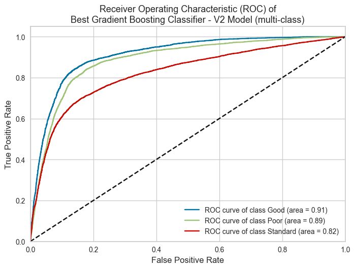
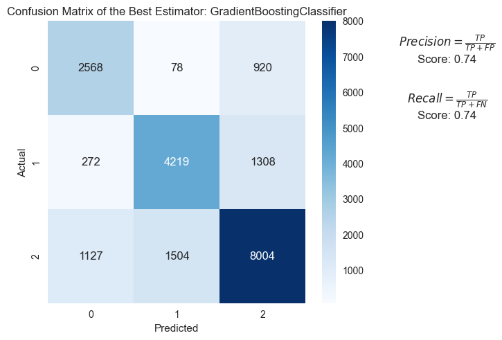
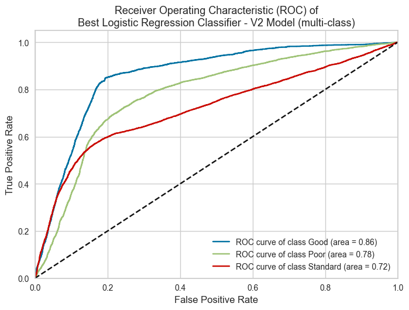
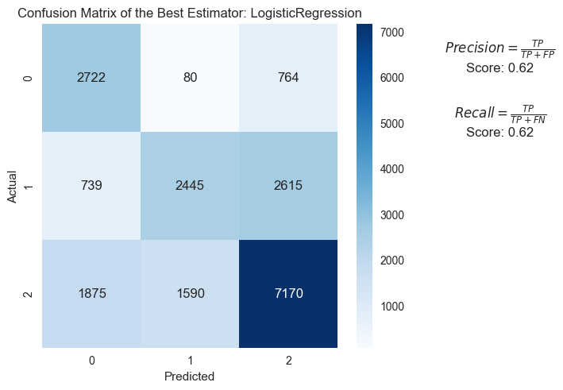
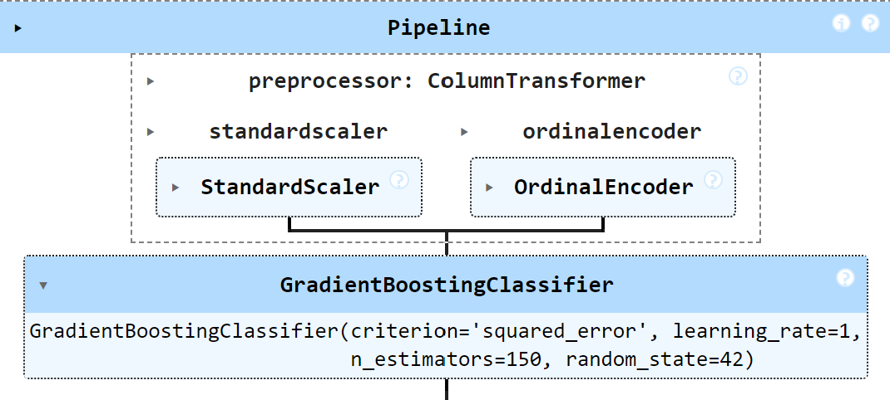
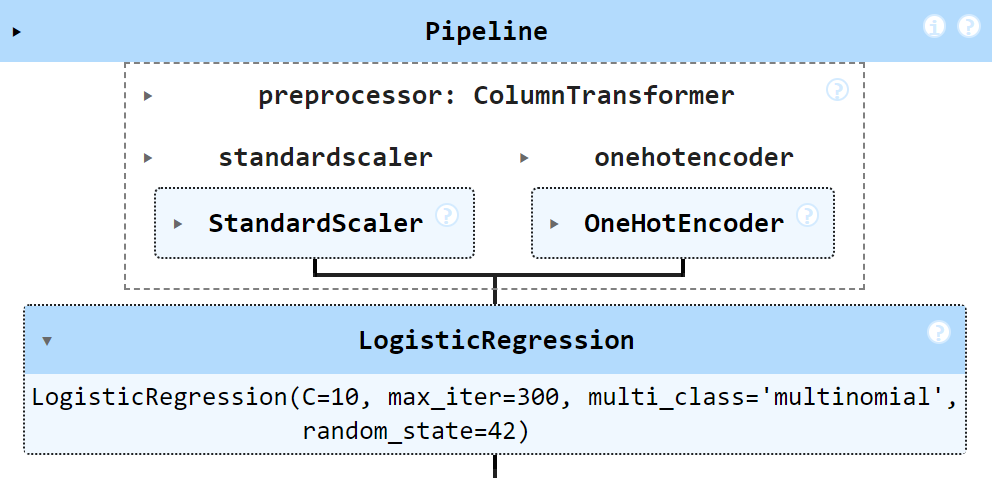

# Project Title
#### Enhancing Credit Score Prediction To Promote Financial Inclusion

**Author**: Vassilis Tsoubris

## Executive summary

### Rationale -NOT_FINAL
Financial inclusion aims to provide access to financial services for all individuals,
especially those who have been traditionally excluded.
One significant barrier to financial inclusion is the reliance on traditional credit scores,
which often disadvantage people with limited credit history or unconventional financial behavior.

By using Machine Learning approaches......

### Research Question -NOT_FINAL
Can machine learning and AI models accurately predict individual credit scores based on financial, behavioural and demographic data,
thereby improving the decision-making process for lending institutions and promote Financial Inclusion for individuals?

### Data Sources -NOT_FINAL
The primary dataset for this analysis will be sourced from Kaggle, specifically the "Credit Score Classification" dataset available at this [link](https://www.kaggle.com/datasets/parisrohan/credit-score-classification?select=train.csv).

This dataset contains historical financial data, including payment history, credit usage, and personal demographics, crucial for predicting credit scores. The target variable is the credit score of the customer ( 3 classes: Poor, Standard, Good ).
This dataset consists of 25 columns and contains 12500 customers (100k observations, 8 observations per customer). It is quite a challenging dataset as it needs advanced techniques to clean the data and transform its shape.

### Methodology -NOT_FINAL

### Results
The baseline accuracy (the maximum of the relative frequencies of the unique values) is 51.88% for the small subset (12.5k observations) and 53.17% for the bigger subset (100k observations).
Every model that achieves a performance equal or greater than the above baseline accuracies could be considered for deployment. Furthermore, the models are evaluated in ROC curves and AUC scores.

By using the small subset (11 features and 12.5k observations) of the cleaned dataset (only 1 of the 8 included months per customer) Logistic Regression, KNN, Decision Trees, SVM and Ensemble models were created.
Their results are demonstrated below: 

**Importand note**: You will notice that **test accuracy**, **recall**, **precision** and **f1** are similar. This is because of the **micro-average** used in the metrics. 
**Micro-average** gives more weight to the majority class and is particularly useful when dealing with imbalanced class distributions.

| Models (12.5k observations - 11 features ) | training_time | train_accuracy | test_accuracy     | recall (micro-average)     | precision (micro-average)    | f1_score (micro-average)|   
|--------------------------------------------|--------------|---------------|-------------------|----------------------------|------------------------------|-------------------------|
| Logistic Regression                        | 0.06         | 0.56          | 0.56              | 0.56                       | 0.56                         | 0.56                    |        
| KNN Classifier                             | 0.04         | 1.00          | 0.61              | 0.61                       | 0.61                         | 0.61                    |      
| Decision Tree Classifier                   | 0.04         | 0.59          | 0.61              | 0.61                       | 0.61                         | 0.61                    |
| SVM Classifier                             | 10.13        | 0.60          | 0.60              | 0.60                       | 0.60                         | 0.60                    |
| Random Forest Classifier                   | 4.48         | 0.75          | 0.62              | 0.62                       | 0.62                         | 0.62                    |
| Gradient Boosting Classifier               | 2.17         | 0.65          | 0.62              | 0.62                       | 0.62                         | 0.62                    |

Logistic Regression, Random Forest and Gradient Boosting Classifiers are then trained on the big subset which includes more features and contains all the months per customer (100k observations).
In other words, the dataset contains 14 features and 100k observations. The results of the new final models are shown below:

| Final Models (100k observations - 14 features ) | training_time | train_accuracy | test_accuracy | recall (micro-average)     | precision (micro-average)    | f1_score (micro-average)|   
|-------------------------------------------------|---------------|----------------|---------------|----------------------------|------------------------------|-------------------------|
| Logistic Regression                             | 0.46          | 0.61           | 0.62          | 0.62                       | 0.62                         | 0.62                    |
| Random Forest Classifier                        | 63.88         | 0.88           | 0.80          | 0.80                       | 0.80                         | 0.80                    |
| Gradient Boosting Classifier                    | 33.91         | 0.78           | 0.74          | 0.74                       | 0.74                         | 0.74                    |

According to the above results of the final models:
- Random Forests give excellent results but tend to overfit. In other words, there is a high probability to give wrong predictions if more unseen data is introduced to the problem. We should avoid deploying these models.
- Gradient Boosting Classifiers should be the alternative if the performance is our goal. Although they tend to overfit, the value difference between train and test accuracy score is smaller than of the random forest classifiers'. In other words GB Classifiers are more suitable models for credit scoring.
- If training speed is our goal we should choose Logistic Regression. Logistic Regression is widely used on Credit Scoring systems and has a good performance (not excellent).

Below, the ROC curves of the final chosen models are presented along with their confusion matrices. 

Furthermore , the mapping of classes is demonstrated below (needed to interpret the confusion matrices):
- Good: 0
- Poor: 1
- Standard: 2

**Final Gradient Boosting Classifier**:

**Final Logistic Regression Classifier**:

To check all the ROC-AUC curves and more technical plots you can reference the **Notebook 4**.

Lastly, the structure of the final chosen models is presented below.

**Final Gradient Boosting Classifier**:

**Final Logistic Regression Classifier**:

**Conclusion**: As indicated from the results above, machine learning could be used to produce credit scores of a financial institution's customers.
More specifically, two models could be used in our case; the Gradient Boosting Classifier or the Logistic Regression.

### Next steps -NOT_FINAL
Below there are some recommendations and next steps to incorporate into the project:

- We could use the Optuna package for more advanced and optimised hyperparameters tuning. Optuna uses state-of-the-art algorithms to find optimal solutions (reduce errors-maximise scores). One example is the Nondominated Sorting Genetic Algorithm II (NSGAII).
- We could develop Neural Network models using Tensorflow and Keras. For example CNNs for classification on tabular data could provide excellent performance.
- We could use expert AI models like ANFIS (Artificial Neuro-fuzzy Inference System) which is a more interpretable NN architecture that uses fuzzy logic to explain the rules that it creates. ANFIS could be an excellent case especially if interpretability is needed along with accurate predictions.
- Generally, we could integrate approaches like the SHAP values to better explain the models created.

### Outline of project -NOT_FINAL
Notebooks:
- [Notebook 1 - Initial Data Cleansing and Understanding](DataCleansing.ipynb)
- [Notebook 2 - EDA on Clean Data and final dataset](EDA_cleaned_data.ipynb)
- [Notebook 3 - Feature Engineering and Cross Validation Strategy](Feature_Engineering_and_Data_Splitting.ipynb)
- [Notebook 4 - Modelling Phase, Results and Next-Step Recommendations: ](Models_and_Results.ipynb)

Python Scripts (custom functions):
- [Custom functions used on Notebook 2 (mostly used on visualisation)](custom_functions/utility_functions.py) 
- [Custom preprocessing functions used on Notebook 4](custom_functions/preprocessor.py)
- [Custom plotting and results demonstration functions used on Notebook 4](custom_functions/Fmodel_results_plots.py)

### Contact and Further Information
Contact me through:
- [LinkedIn](https://www.linkedin.com/in/vtsoubris/)
